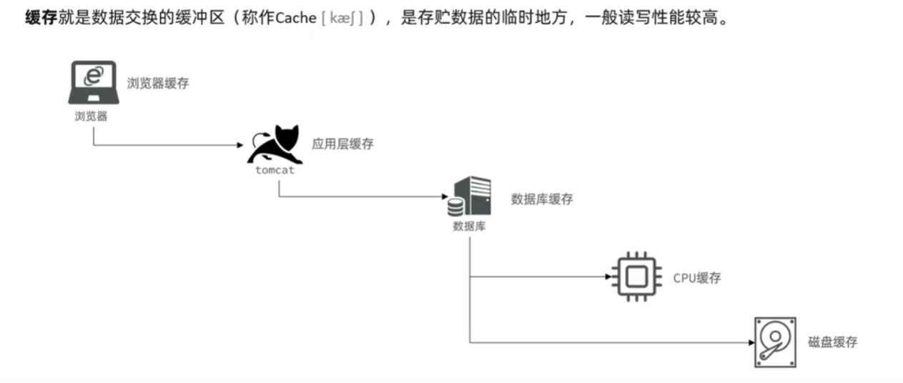
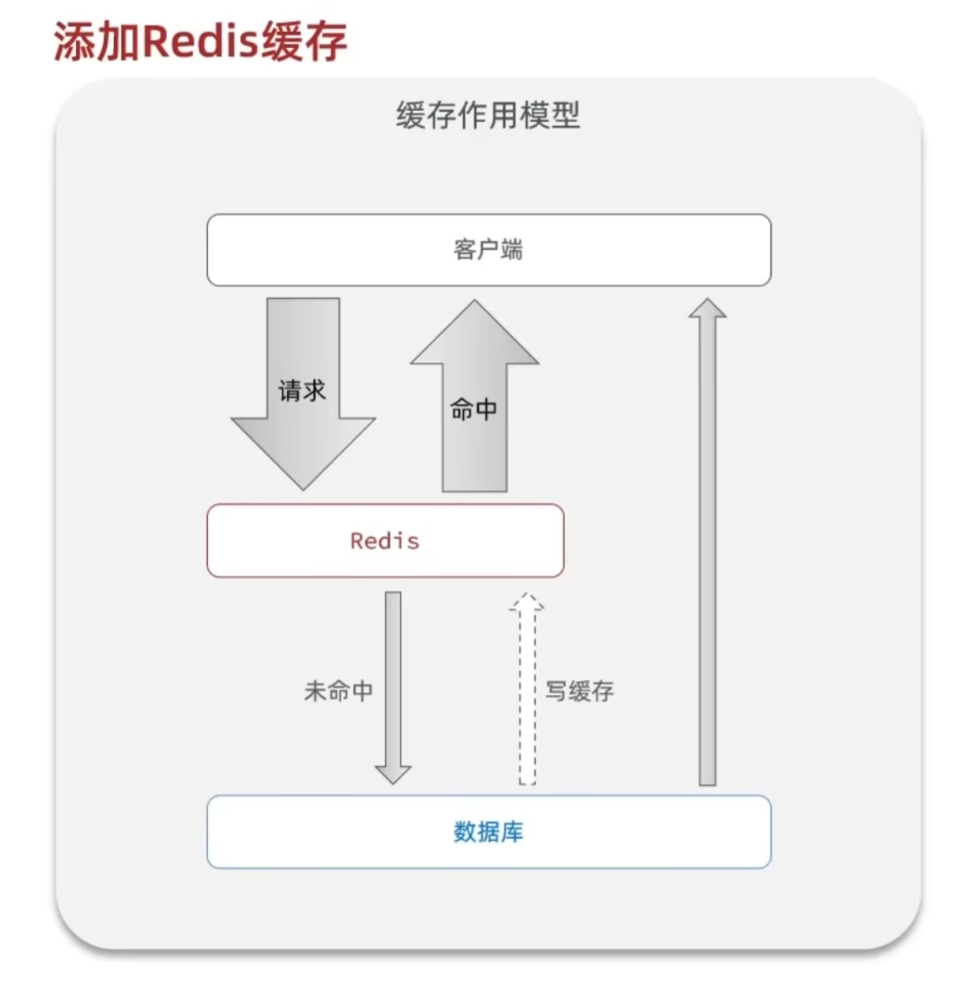
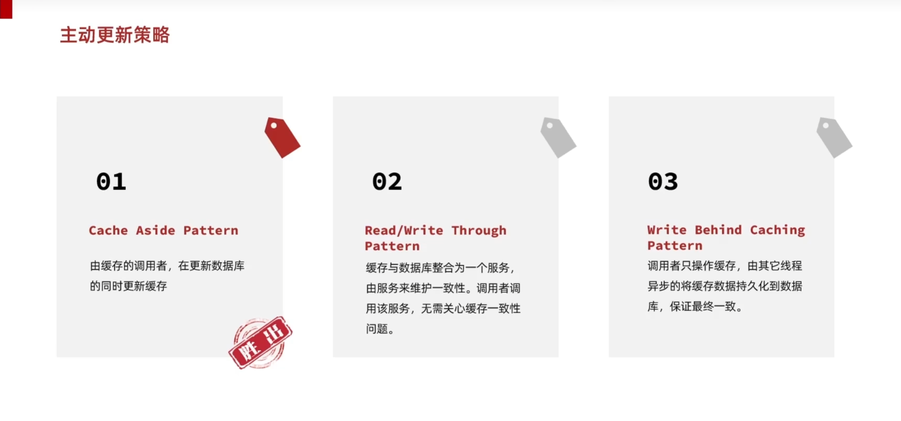
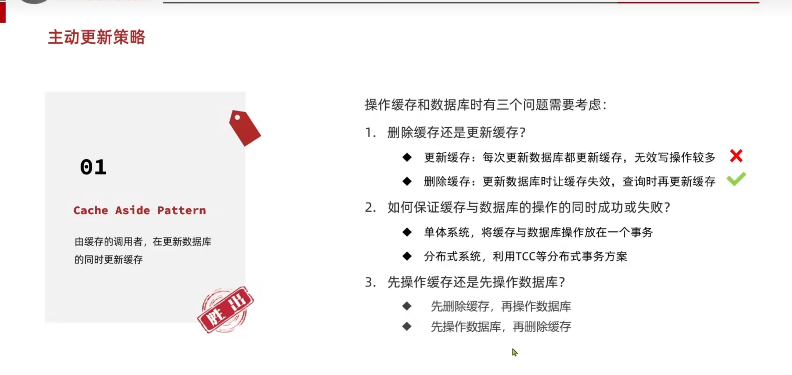
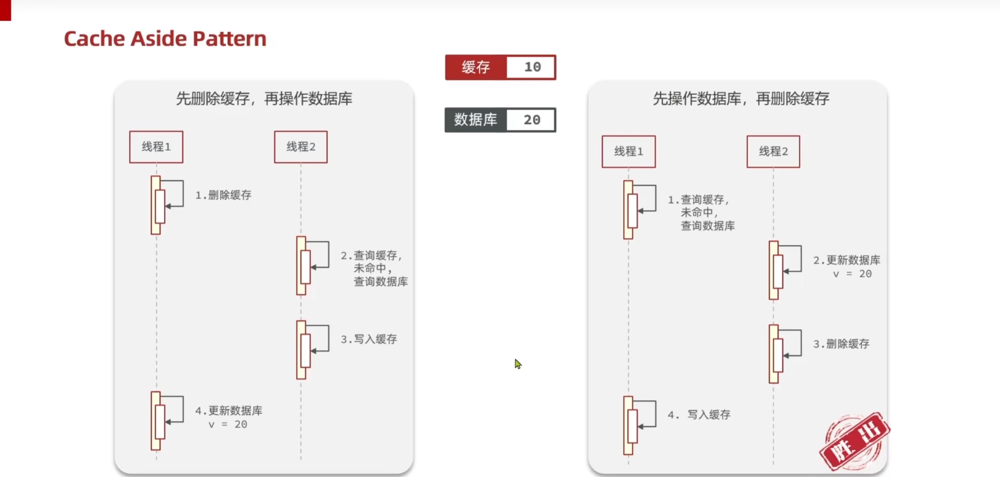
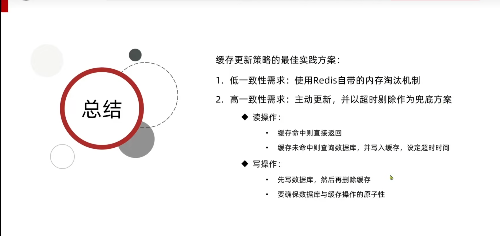
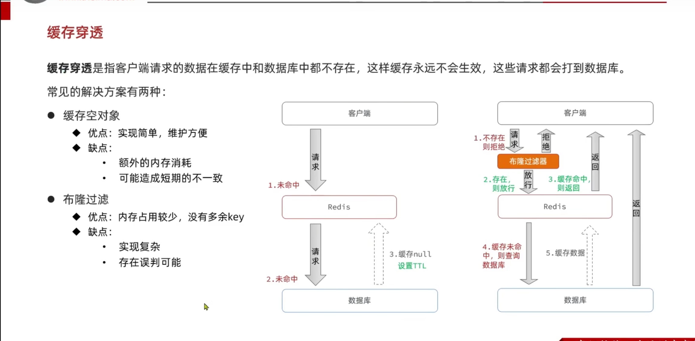
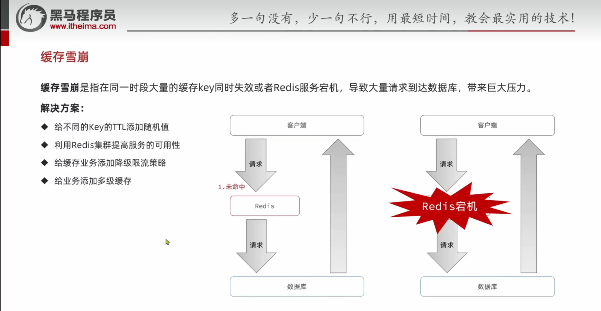

# 黑马点评项目

## 一、基于 session 注册的原理

基于 Session 的注册原理，本质是利用服务器端的 Session 机制在用户注册过程中临时存储用户状态（如验证码、临时信息），并在注册成功后创建用户会话，实现用户身份的临时关联。下面从流程和技术细节两方面详细解释：
一、核心流程：Session 在注册中的作用
用户注册的典型流程中，Session 主要用于和，步骤如下：
二、技术细节：Session 如何实现 “状态保持”
三、与 Cookie 的区别（为何用 Session 存敏感信息）
：存储在客户端（浏览器），可被用户篡改（如伪造验证码），适合存非敏感信息（如 SessionID）；
：存储在服务器端，用户无法直接修改，适合存敏感信息（如验证码、用户 ID），因此注册中的验证信息必须存在 Session 中，而非 Cookie。
总结
用 SessionID 关联用户与服务器的会话；
用 Session 临时存储注册过程中的敏感验证信息（如验证码），确保验证安全;
注册成功后，通过 Session 保存用户登录状态，实现后续请求的身份识别。
简单说，Session 就是注册过程中 “服务器记住用户” 的核心机制，既保证了验证安全，又实现了用户状态的连续关联。

## 二、redis 缓存索引

【Redis 索引是 “用合适的数据结构存储查询维度与目标数据的关联关系”】
Redis 中缓存索引的核心是存储 “索引维度（查询条件）→ 目标数据标识 / 关联数据” 的映射关系，而非简单的 “key 是索引，value 是数据”。索引的载体可以是 Redis 的 key，也可以是 Hash 的 field、Set 的 member 等，value 通常是数据 ID 集合、关联标识或轻量化数据（而非完整业务数据，完整数据可再缓存或查库）。

## 三、请求过程中的多级缓存示意图

## 添加缓存示意图

## BeanUtil.copyToList 是 Hutool 中用于 “对象列表 → 对象列表” 的属性复制工具

## 四、缓存更新策略

## 主动更新策略

## 手动操作缓存常见问题

## 更新数据库时，线程并发安全问题

## 缓存最佳实践方案

## 五、企业常见缓存热点问题

### 缓存穿透问题及其解决方案

### 缓存穿透总结

### 缓存雪崩解决方案

1. 实际项目中的限流组合策略（推荐）
   真实场景中，不会只依赖某一种限流，而是「多层限流防御」：
   第一层：网关限流（整体流量入口）
   用 Spring Cloud Gateway + Sentinel 对进入集群的「总流量」限流（比如网关层限制每秒 5 万 QPS），挡掉大部分恶意流量 / 突发流量，减轻后续服务压力。
   第二层：服务级限流（保护单个服务）
   对每个微服务设置「服务级 QPS 阈值」（比如商品服务每秒 1 万 QPS），避免单个服务过载。
   第三层：依赖级限流（保护核心依赖）
   对访问数据库、Redis、第三方接口的「细粒度资源」限流（比如数据库查询每秒 3000 QPS，Redis 每秒 10 万 QPS），针对性保护瓶颈组件。

2. 热点 key 预缓存：项目初次加载时，一次性预缓存大量数据（比如全量商品分类、所有热门店铺），如果这些 key 都设置相同的过期时间（比如都是 24 小时），那么 24 小时后这些 key 会集中过期，瞬间导致大量请求穿透到数据库，引发缓存雪崩。

3. 除了初次加载的批量数据，任何`批量`生成缓存 key 的场景都需要随机值：
   定时任务批量刷新缓存（比如每天凌晨刷新热门商品缓存）；
   活动上线时批量缓存活动相关数据（比如秒杀商品列表）；
   业务逻辑中批量查询并缓存数据（比如一次查询 10 个店铺并缓存）。
   这些场景下的 key 如果不设置随机过期时间，都可能出现集中过期的风险。
